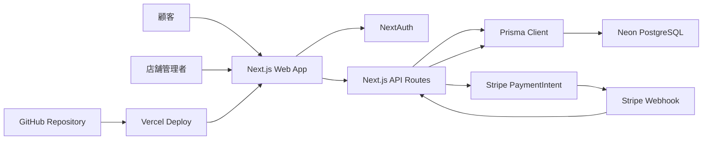

# 02 System Architecture

## システム構成

YoyakuはNext.jsを中心に、Prisma、Neon PostgreSQL、Stripe、GitHub、Vercelを組み合わせて構成します。

## Next.js

Next.jsはフロントエンド、管理画面、API Route、認証ルートを担います。App Routerを使用し、顧客向け予約フローと管理画面を同じアプリケーション内で管理します。

## Prisma

Prismaはデータベースアクセス層です。予約、スタッフ、シフト、営業時間、休業日、決済試行、管理者ユーザーなどのモデルを管理します。

## Neon

NeonはPostgreSQLのマネージドデータベースとして使用します。予約データ、顧客情報、スタッフ情報、決済状態を保存します。

## Stripe

Stripeは予約金決済を担当します。PaymentIntentを使い、決済成功Webhookを受けて予約を確定します。

## GitHub

GitHubはソースコード、事業ドキュメント、運用ドキュメント、Issue、Pull Request、変更履歴の管理場所です。

## Vercel

VercelはNext.jsアプリケーションのホスティング、プレビュー環境、本番デプロイを担当します。

## 構成図

