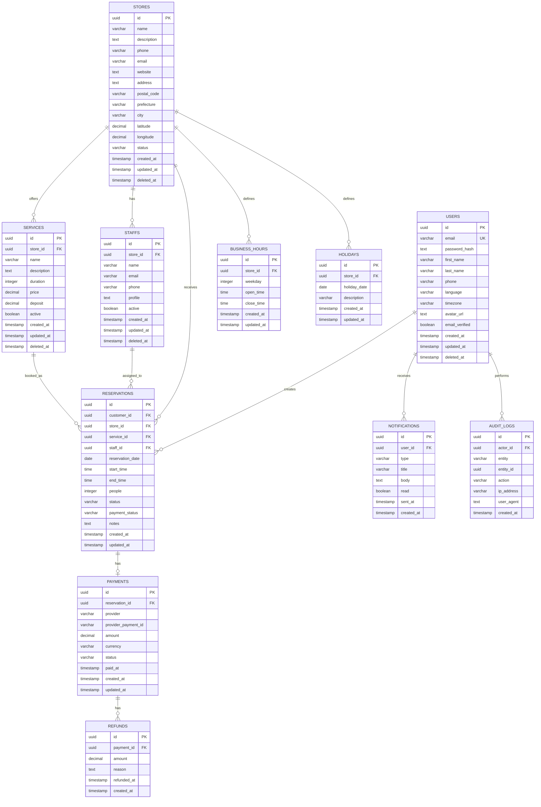

# ER Diagram

## Overview

This document defines the Entity Relationship Diagram for Yoyaku Version 1.0.

The ER Diagram represents the logical relationships between the main entities required for reservation search, booking, payment, cancellation, store management, member management, and administration.

---

# ER Diagram



---

# Entity Summary

| Entity | Description |
|--------|-------------|
| users | Customer and account information |
| stores | Business and store information |
| staffs | Staff members belonging to stores |
| services | Bookable services offered by stores |
| reservations | Reservation records |
| payments | Payment transaction records |
| refunds | Refund transaction history |
| business_hours | Regular store operating hours |
| holidays | Store-specific holiday settings |
| notifications | Notification delivery records |
| audit_logs | Immutable audit history |

---

# Relationship Summary

## users to reservations

One user may create many reservations.

```text
users 1 ── * reservations
```

---

## users to notifications

One user may receive many notifications.

```text
users 1 ── * notifications
```

---

## stores to staffs

One store may have many staff members.

```text
stores 1 ── * staffs
```

---

## stores to services

One store may offer many services.

```text
stores 1 ── * services
```

---

## stores to business_hours

One store may define multiple business hour records.

```text
stores 1 ── * business_hours
```

---

## stores to holidays

One store may define many holiday records.

```text
stores 1 ── * holidays
```

---

## stores to reservations

One store may receive many reservations.

```text
stores 1 ── * reservations
```

---

## staffs to reservations

One staff member may be assigned to many reservations.

```text
staffs 1 ── * reservations
```

---

## services to reservations

One service may be booked through many reservations.

```text
services 1 ── * reservations
```

---

## reservations to payments

One reservation may have zero or one payment record.

```text
reservations 1 ── 0..1 payments
```

---

## payments to refunds

One payment may have multiple refund records.

```text
payments 1 ── * refunds
```

---

## users to audit_logs

One user may perform many auditable actions.

```text
users 1 ── * audit_logs
```

---

# Cardinality Rules

| Relationship | Cardinality |
|-------------|-------------|
| User → Reservation | 1:N |
| User → Notification | 1:N |
| User → AuditLog | 1:N |
| Store → Staff | 1:N |
| Store → Service | 1:N |
| Store → BusinessHour | 1:N |
| Store → Holiday | 1:N |
| Store → Reservation | 1:N |
| Staff → Reservation | 1:N |
| Service → Reservation | 1:N |
| Reservation → Payment | 1:0..1 |
| Payment → Refund | 1:N |

---

# Integrity Rules

The database shall enforce the following integrity rules.

- A reservation must belong to one customer.
- A reservation must belong to one store.
- A reservation must belong to one service.
- A reservation must belong to one staff member.
- A payment must belong to one reservation.
- A refund must belong to one payment.
- A staff member must belong to one store.
- A service must belong to one store.
- Business hours must belong to one store.
- Holidays must belong to one store.
- Notifications must belong to one user.
- Audit logs should reference the actor user when available.

---

# Deletion Rules

## Soft Delete

The following entities shall support soft deletion.

- users
- stores
- staffs
- services

Soft-deleted records shall remain available for historical references.

---

## Hard Delete

The following entities shall not be hard deleted during normal operations.

- reservations
- payments
- refunds
- audit_logs

These records are historical and must remain available for legal, accounting, and operational traceability.

---

# Reservation Relationship Rules

A reservation is valid only when:

- customer_id references an existing user.
- store_id references an existing store.
- service_id references an existing service.
- staff_id references an existing staff member.
- the staff member belongs to the reservation store.
- the service belongs to the reservation store.
- the staff member is assigned to the selected service.
- the reservation time does not conflict with another reservation.

---

# Payment Relationship Rules

A payment is valid only when:

- reservation_id references an existing reservation.
- payment amount matches the required reservation payment.
- payment currency is supported.
- payment status is synchronized with the reservation payment status.

---

# Refund Relationship Rules

A refund is valid only when:

- payment_id references an existing payment.
- refund amount does not exceed the paid amount.
- total refund amount does not exceed total payment amount.

---

# Audit Log Relationship Rules

Audit logs shall preserve historical references.

If the actor user is deleted or deactivated, audit log records shall remain available.

Audit logs shall never be edited or deleted.

---

# Indexing Strategy

The following indexes are required.

```text
users.email

reservations.customer_id

reservations.store_id

reservations.staff_id

reservations.service_id

reservations.reservation_date

reservations.status

reservations.payment_status

payments.reservation_id

payments.status

business_hours.store_id

holidays.store_id

notifications.user_id

audit_logs.actor_id

audit_logs.entity

audit_logs.entity_id
```

---

# Composite Indexes

The following composite indexes are required for reservation search performance.

```text
reservations.store_id + reservations.reservation_date

reservations.staff_id + reservations.reservation_date

reservations.store_id + reservations.staff_id + reservations.reservation_date

reservations.reservation_date + reservations.start_time

business_hours.store_id + business_hours.weekday

holidays.store_id + holidays.holiday_date
```

---

# Future Entities

Future versions may add:

- organizations
- store_groups
- staff_schedules
- staff_holidays
- service_categories
- coupons
- memberships
- loyalty_points
- reviews
- waitlists
- invoices
- subscriptions
- webhooks
- api_keys
- external_integrations
- ai_recommendations

---

# ER Diagram Summary

This ER Diagram defines the canonical logical data model for Yoyaku Version 1.0.

All database schema definitions, Prisma models, migrations, API contracts, validation rules, and implementation logic shall follow the relationships and integrity rules defined in this document.
