# Sequence Diagram

## Overview

This document defines the main sequence diagrams for Yoyaku Version 1.0.

Sequence diagrams describe how users, client applications, APIs, domain services, databases, and external services interact during important system workflows.

All implementations shall follow these interaction patterns.

---

# Sequence Diagram Principles

Every sequence shall follow these principles.

- Client applications never bypass APIs.
- Business logic is executed on the server side.
- Database mutations occur only through validated services.
- Critical operations use transactions.
- Payment operations use idempotency.
- External webhooks are verified.
- Every important action is logged.
- Every state transition is audited.

---

# Actors and Components

## Actors

- Guest
- Customer
- Store Owner
- Staff
- Administrator
- System

---

## System Components

- Web Client
- API Layer
- Auth Service
- User Service
- Search Service
- Reservation Service
- Payment Service
- Notification Service
- Store Service
- Admin Service
- Database
- Stripe
- Email Provider
- Push Provider
- Audit Log

---

# Customer Registration Sequence

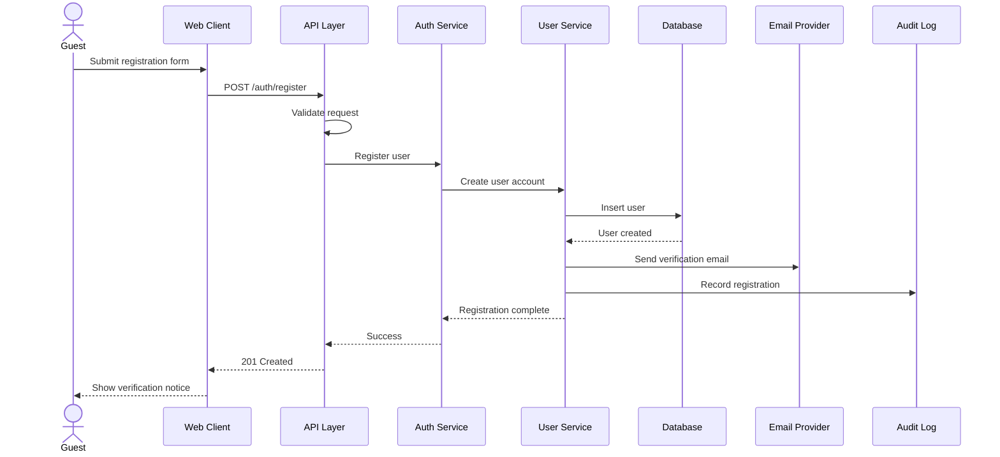

---

# Customer Login Sequence

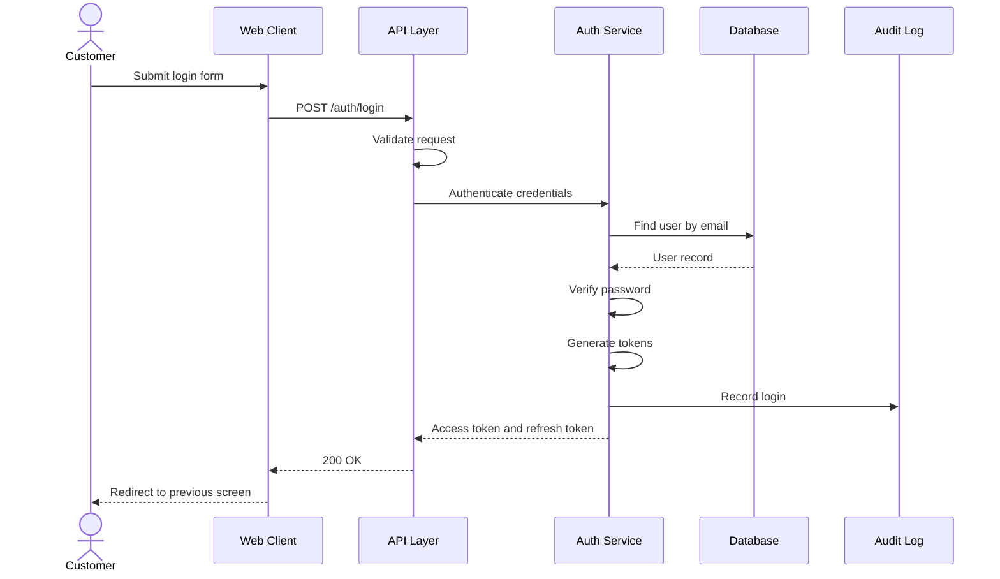

---

# Reservation Search Sequence

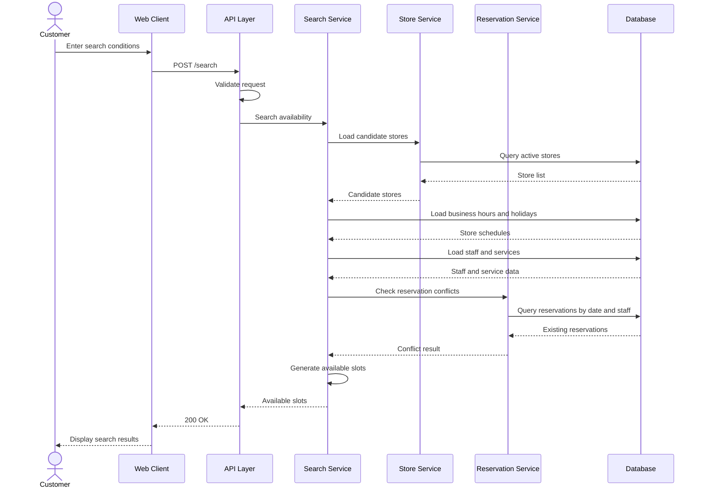

---

# Reservation Creation Sequence

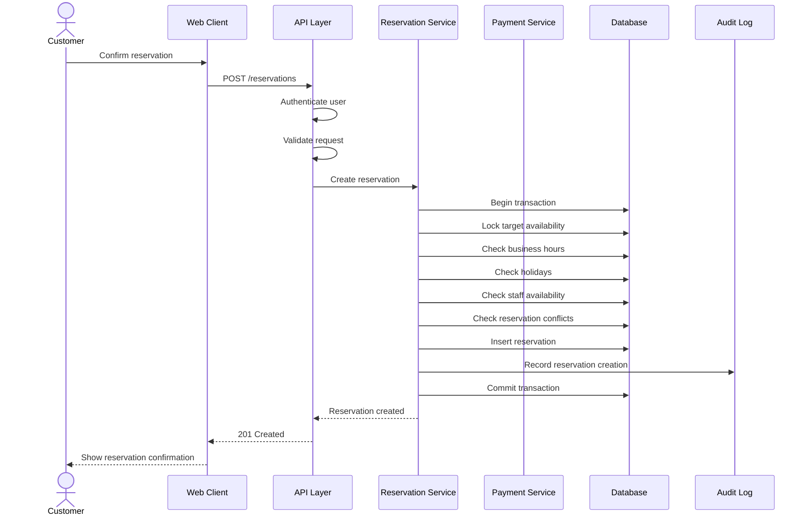

---

# Reservation With Payment Sequence

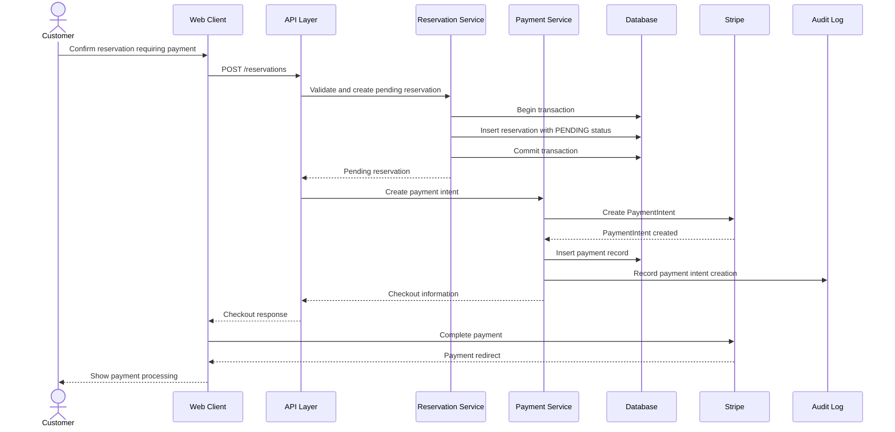

---

# Stripe Webhook Payment Success Sequence

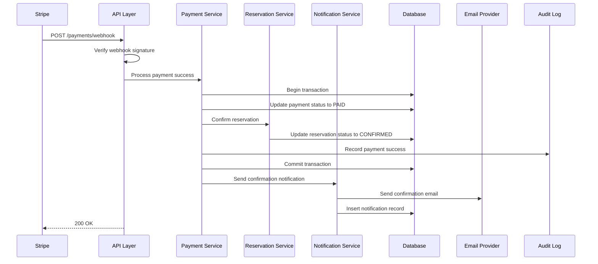

---

# Payment Failure Sequence

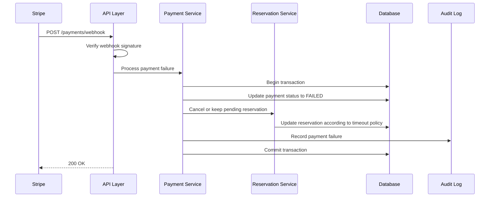

---

# Reservation Cancellation Sequence

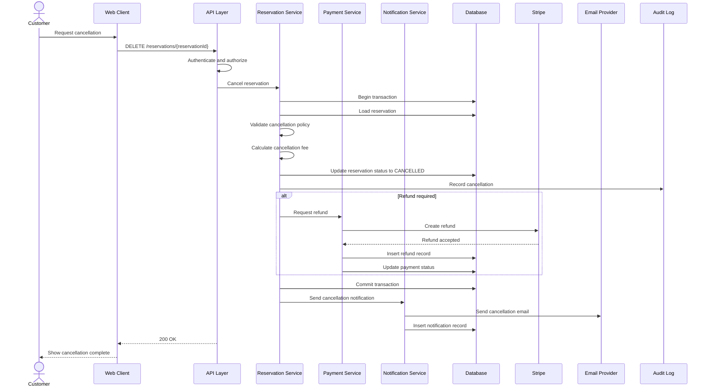

---

# Store Business Hours Update Sequence

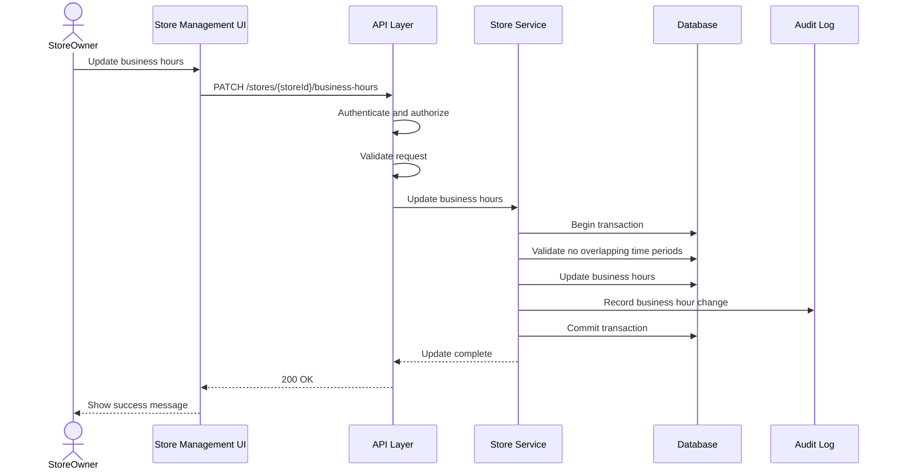

---

# Service Creation Sequence

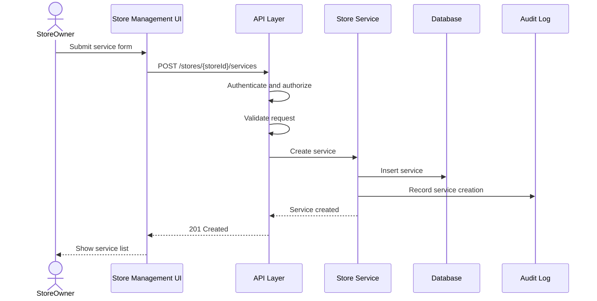

---

# Staff Creation Sequence

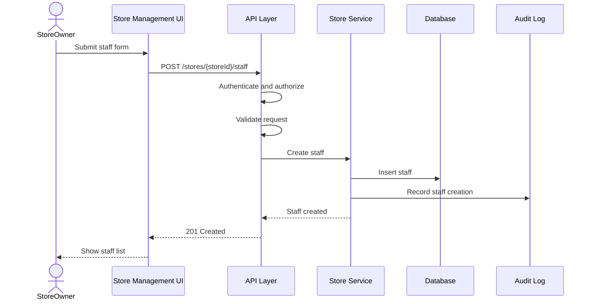

---

# Customer Profile Update Sequence

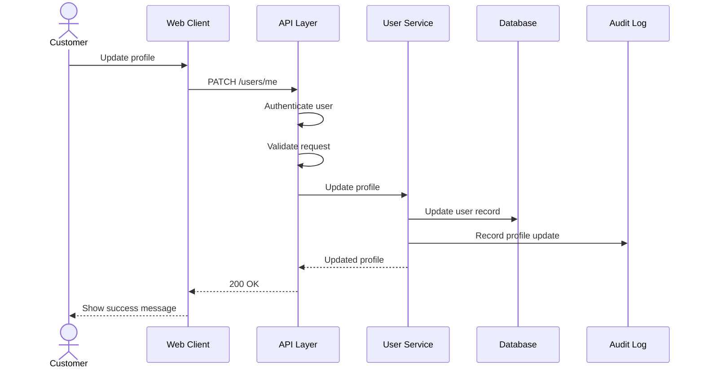

---

# Notification Delivery Sequence

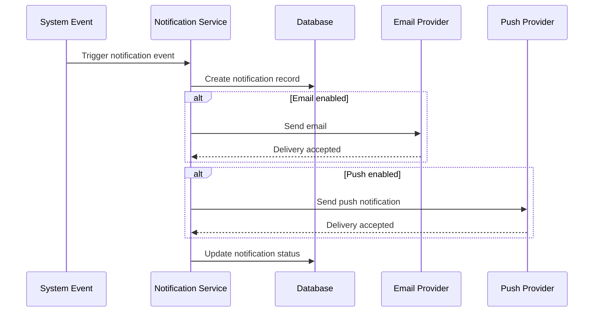

---

# Admin User Suspension Sequence

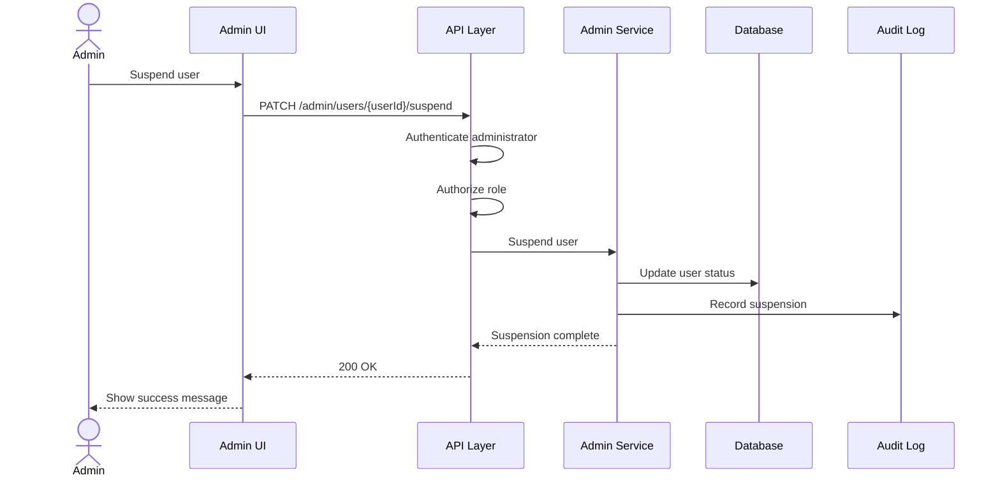

---

# Admin Store Suspension Sequence

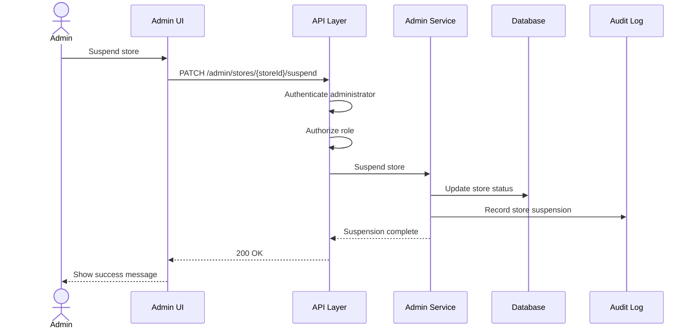

---

# Audit Logging Sequence

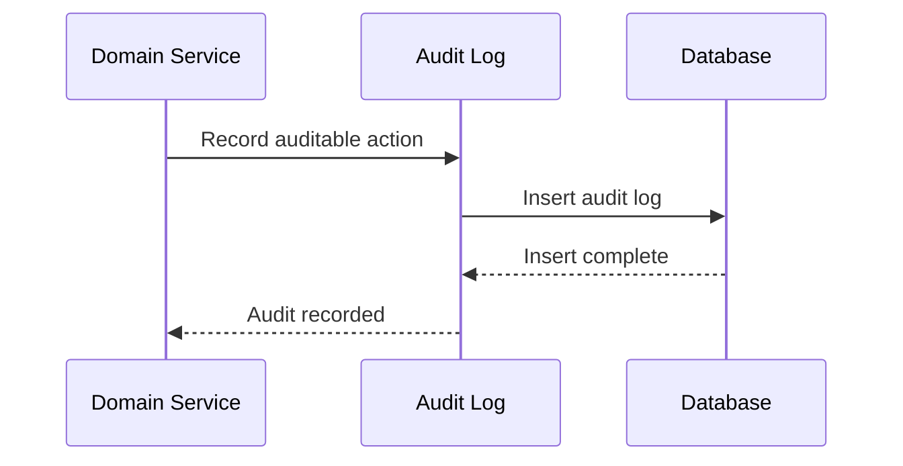

---

# Error Handling Sequence

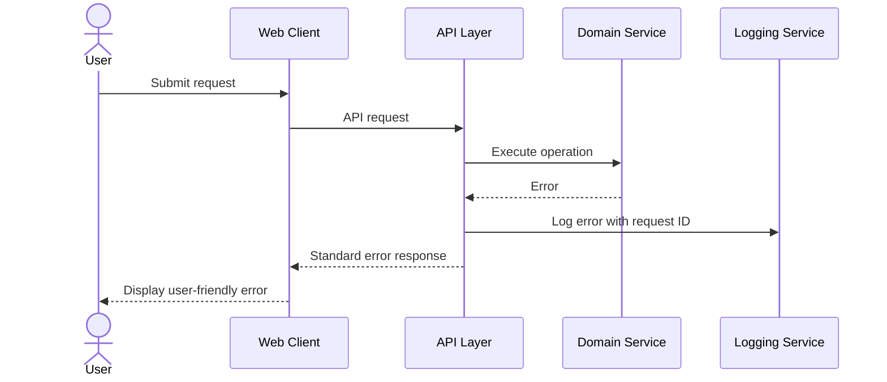

---

# Idempotent Reservation Creation Sequence

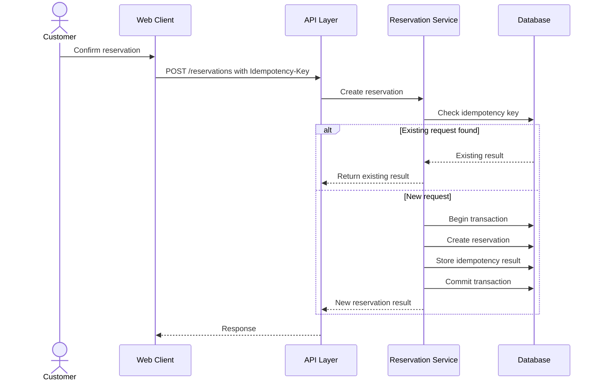

---

# Sequence Diagram Summary

This document defines the primary system interaction sequences for Yoyaku Version 1.0.

All implementation shall follow these sequences to ensure consistency, security, transactional integrity, auditable operations, and reliable user experience.
