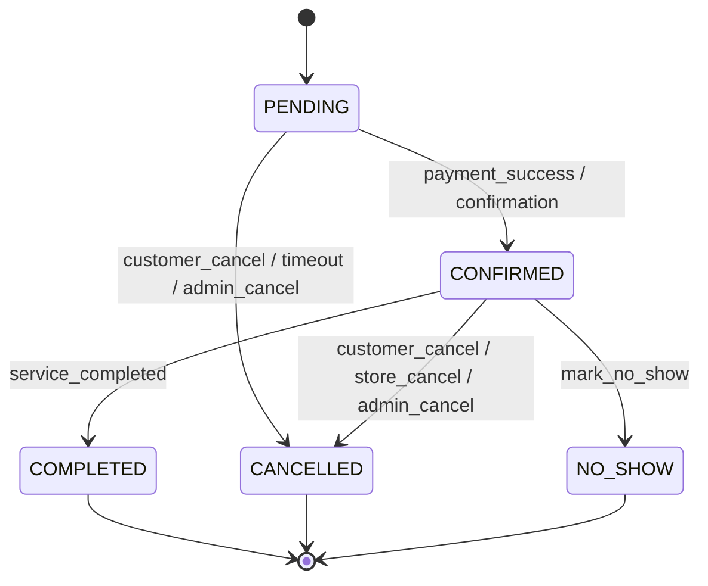
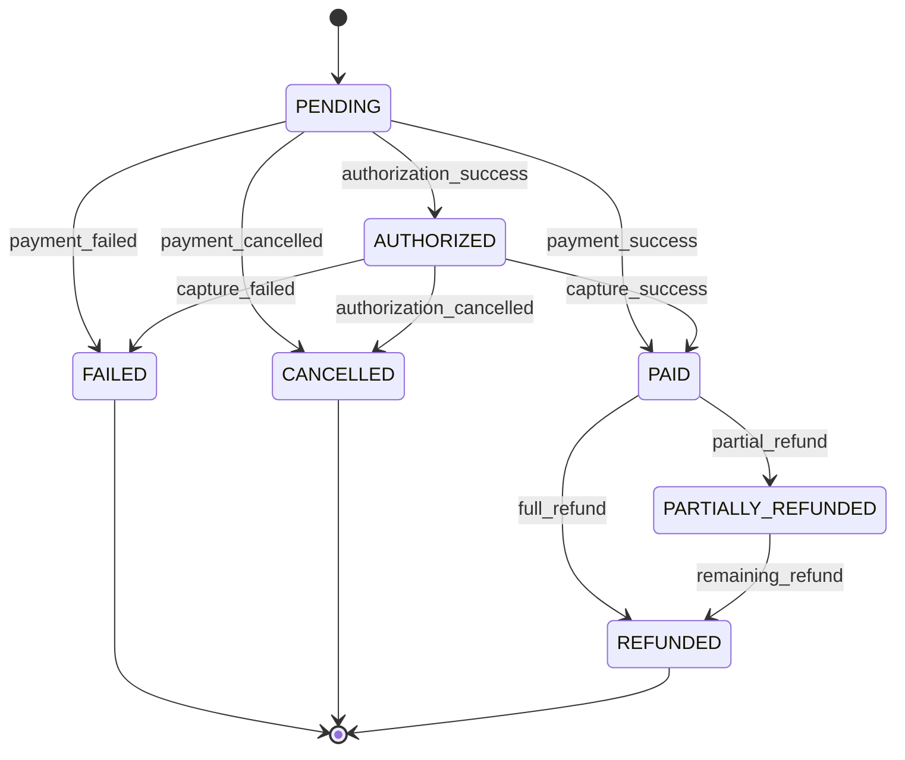
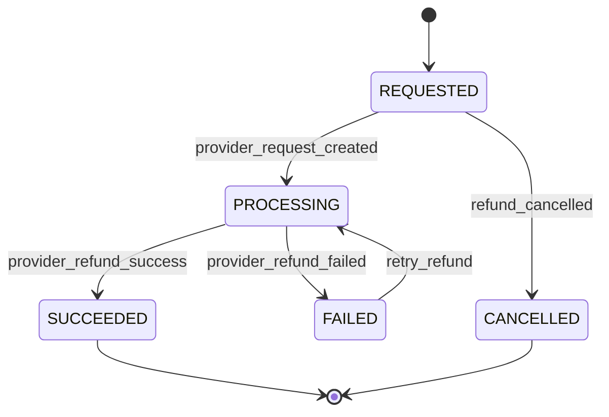
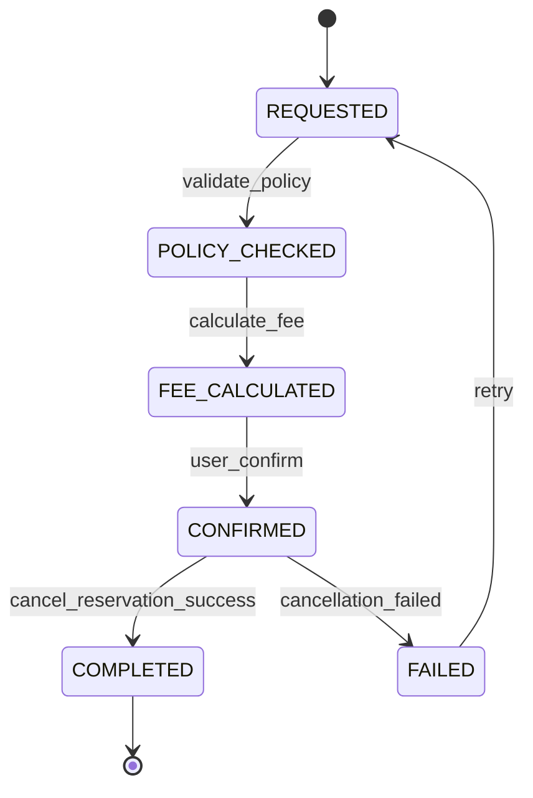
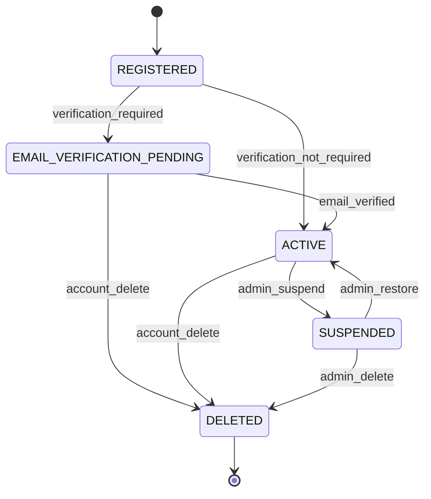
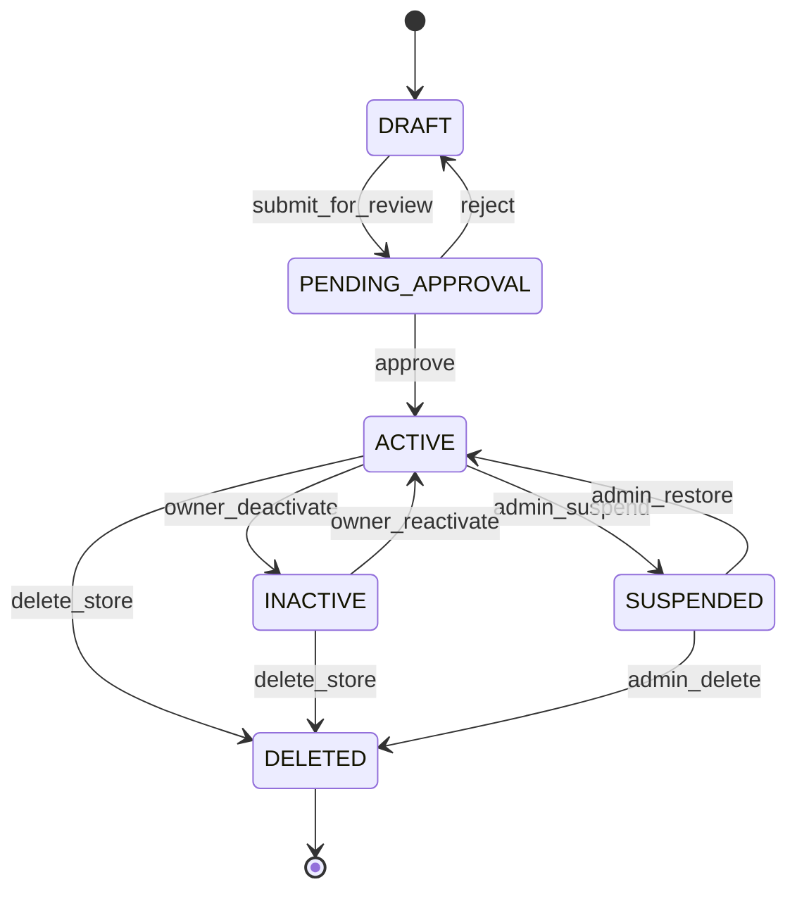
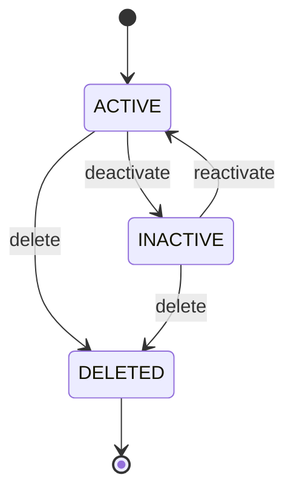
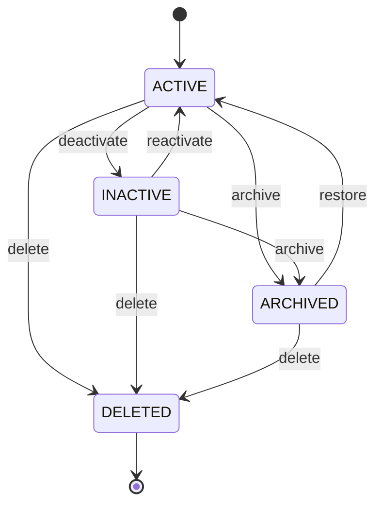
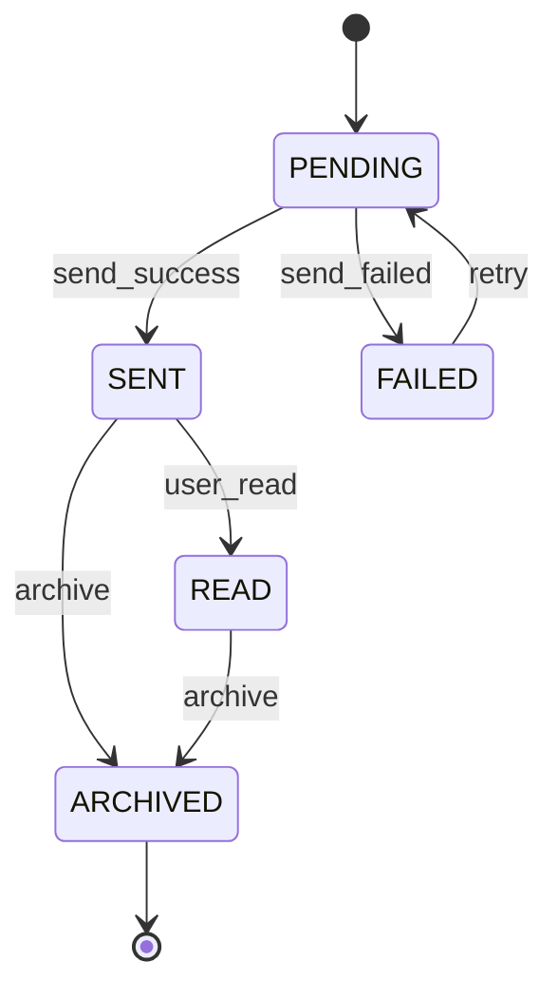
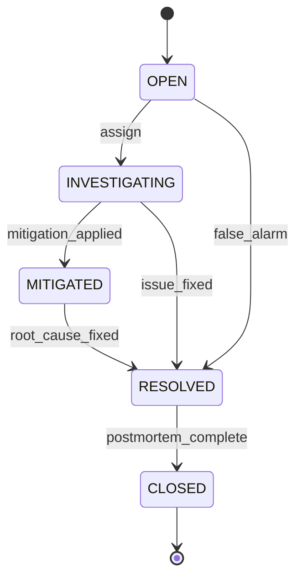

# State Machine Specification

## Overview

This document defines the state machines for Yoyaku Version 1.0.

State machines describe the valid lifecycle states and transitions for reservations, payments, refunds, cancellations, users, stores, staff, services, notifications, and administrative incidents.

All state transitions shall be enforced on the server side.

---

# State Machine Principles

Every state machine shall satisfy the following principles.

- Valid transitions only.
- Server-side enforcement.
- Immutable audit logging.
- No silent state changes.
- Idempotent transition handling.
- Clear error response for invalid transitions.
- Transactional consistency.

---

# Reservation State Machine

## Reservation States

```text
PENDING

CONFIRMED

COMPLETED

CANCELLED

NO_SHOW
```

---

## Reservation State Diagram



---

## Reservation Transition Table

| Current State | Event | Next State | Allowed Actor |
|---------------|-------|------------|---------------|
| PENDING | payment_success | CONFIRMED | System |
| PENDING | confirmation | CONFIRMED | System |
| PENDING | customer_cancel | CANCELLED | Customer |
| PENDING | timeout | CANCELLED | System |
| PENDING | admin_cancel | CANCELLED | Administrator |
| CONFIRMED | service_completed | COMPLETED | Staff / Store Owner |
| CONFIRMED | customer_cancel | CANCELLED | Customer |
| CONFIRMED | store_cancel | CANCELLED | Store Owner |
| CONFIRMED | admin_cancel | CANCELLED | Administrator |
| CONFIRMED | mark_no_show | NO_SHOW | Staff / Store Owner |
| COMPLETED | any | invalid | None |
| CANCELLED | any | invalid | None |
| NO_SHOW | any | invalid | None |

---

## Reservation Invalid Transitions

The following transitions are invalid.

- COMPLETED to CANCELLED
- CANCELLED to CONFIRMED
- CANCELLED to COMPLETED
- NO_SHOW to COMPLETED
- NO_SHOW to CANCELLED
- CONFIRMED to PENDING

Invalid transitions shall return:

```text
INVALID_STATUS_TRANSITION
```

---

# Payment State Machine

## Payment States

```text
PENDING

AUTHORIZED

PAID

FAILED

CANCELLED

REFUNDED

PARTIALLY_REFUNDED
```

---

## Payment State Diagram



---

## Payment Transition Table

| Current State | Event | Next State | Allowed Actor |
|---------------|-------|------------|---------------|
| PENDING | authorization_success | AUTHORIZED | Payment Provider |
| PENDING | payment_success | PAID | Payment Provider |
| PENDING | payment_failed | FAILED | Payment Provider |
| PENDING | payment_cancelled | CANCELLED | Customer / Provider |
| AUTHORIZED | capture_success | PAID | Payment Provider |
| AUTHORIZED | authorization_cancelled | CANCELLED | Payment Provider |
| AUTHORIZED | capture_failed | FAILED | Payment Provider |
| PAID | partial_refund | PARTIALLY_REFUNDED | System / Administrator |
| PAID | full_refund | REFUNDED | System / Administrator |
| PARTIALLY_REFUNDED | remaining_refund | REFUNDED | System / Administrator |

---

# Refund State Machine

## Refund States

```text
REQUESTED

PROCESSING

SUCCEEDED

FAILED

CANCELLED
```

---

## Refund State Diagram



---

## Refund Transition Table

| Current State | Event | Next State | Allowed Actor |
|---------------|-------|------------|---------------|
| REQUESTED | provider_request_created | PROCESSING | System |
| REQUESTED | refund_cancelled | CANCELLED | Administrator |
| PROCESSING | provider_refund_success | SUCCEEDED | Payment Provider |
| PROCESSING | provider_refund_failed | FAILED | Payment Provider |
| FAILED | retry_refund | PROCESSING | Administrator |

---

# Cancellation State Machine

## Cancellation States

```text
REQUESTED

POLICY_CHECKED

FEE_CALCULATED

CONFIRMED

COMPLETED

FAILED
```

---

## Cancellation State Diagram



---

# User Account State Machine

## User States

```text
REGISTERED

EMAIL_VERIFICATION_PENDING

ACTIVE

SUSPENDED

DELETED
```

---

## User State Diagram



---

# Store State Machine

## Store States

```text
DRAFT

PENDING_APPROVAL

ACTIVE

INACTIVE

SUSPENDED

DELETED
```

---

## Store State Diagram



---

# Staff State Machine

## Staff States

```text
ACTIVE

INACTIVE

DELETED
```

---

## Staff State Diagram



---

# Service State Machine

## Service States

```text
ACTIVE

INACTIVE

ARCHIVED

DELETED
```

---

## Service State Diagram



---

# Notification State Machine

## Notification States

```text
PENDING

SENT

FAILED

READ

ARCHIVED
```

---

## Notification State Diagram



---

# Incident State Machine

## Incident States

```text
OPEN

INVESTIGATING

MITIGATED

RESOLVED

CLOSED
```

---

## Incident State Diagram



---

# Transition Enforcement

All state transitions shall be enforced by:

- Domain service layer
- Server-side validation
- Database transaction
- Audit log creation

Client applications shall never directly set final states without server validation.

---

# Transition Audit Logging

Every state transition shall record:

- Entity Type
- Entity ID
- Previous State
- Next State
- Event
- Actor ID
- Timestamp
- Request ID
- IP Address

---

# Transition Error Response

Invalid transitions shall return:

```json
{
  "success": false,
  "error": {
    "code": "INVALID_STATUS_TRANSITION",
    "message": "The requested state transition is not allowed."
  }
}
```

---

# Idempotency

The following transition events shall be idempotent.

- payment_success
- provider_refund_success
- reservation_confirmation
- notification_send_success
- cancellation_completed

Duplicate events shall not create duplicate records or inconsistent states.

---

# State Machine Testing

Every state machine shall include automated tests for:

- Valid transitions
- Invalid transitions
- Idempotent events
- Permission enforcement
- Audit log creation
- Transaction rollback

---

# State Machine Specification Summary

This document defines the valid lifecycle states and transitions for all major Yoyaku Version 1.0 entities.

All application logic, API endpoints, database updates, background jobs, administrative tools, and automated tests shall conform to these state machines.
